# CarND-P3 Behavioral Cloning

## Description

**This my 3rd project result of Udacity self-driving car nanodegree (CarND). It required using Udacity driving simulator to manually collect image and steering data of good driving behavior, build a convolution neural network in Keras that predicts steering angles from images and finally test that the model successfully drives around track without leaving the road. I used model similar to Nvidia used in End to End Learning for Self-Driving Cars (https://arxiv.org/pdf/1604.07316v1.pdf) as base architecture, inserted one dropout layer to prevent overfitting and adapted beginning layers with normalization and cropping layers**

* Udacity self-driving car nanodegree (CarND) :

  https://www.udacity.com/course/self-driving-car-engineer-nanodegree--nd013

* CarND Behavioral Cloning starter repository

  https://github.com/udacity/CarND-Behavioral-Cloning-P3

* Udacity self-driving car simulator

  https://github.com/udacity/self-driving-car-sim
  
* Nvidia End to End Learning for Self-Driving Cars :

  https://arxiv.org/pdf/1604.07316v1.pdf

## Dataset of this project

* The size of all data is 35126 (80% of them are collected as training set, 20% are collected as validation set) 
* The shape of an input image is (160, 320, 3), i.e. 160 x 320 RGB pixel 
* The output is steering angle value

## Training method of this project
* 5 epochs used
* Adam optimizer used

## Model of this project 

The final model architecture (model.py lines 103-116) is consisted of 1 normalization layer, 1 cropping layer to crop out non-road region, 3 convolution neural network with 5x5 filter followed by RELU activation layer, 2 convolution neural network with 3x3 filter followed by RELU activation layer, 1 dropout layer to prevent overfitting, 1 flatten layer, and 4 fully connected layer.

Here is a visualization of the architecture

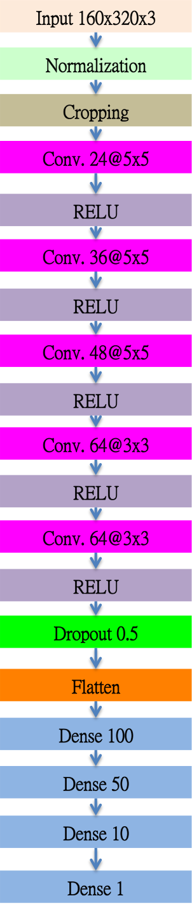

## Creation of the Training Set & Training Process

To capture good driving behavior, I first recorded two laps on track one using center lane driving. Here is an example image of center lane driving:

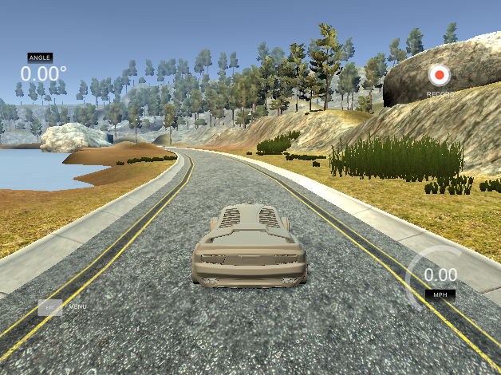

I then recorded couter-clockwise lap with center lane driving to compansate tendency of mostly left turn in clockwise lap.

Afterwares, I recorded the vehicle recovering from the left side and right sides of the road back to center so that the vehicle would learn to recover from side if it steered away from lane center.

These images show what a recovery looks like :

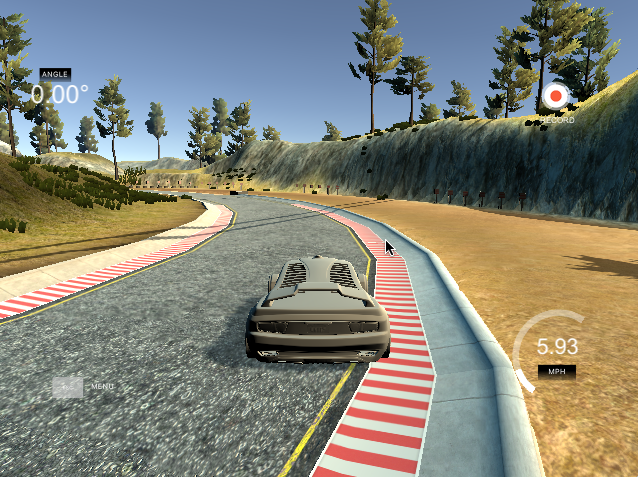 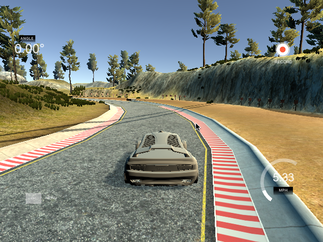 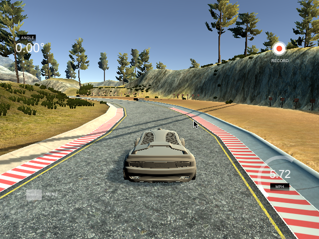

To augment the data sat, I also flipped images and angles. For example, here is an image that has then been flipped:

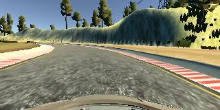 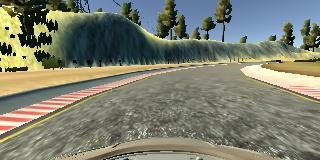

Also, I used left, center and right camera captured image for all driving records and for left and right camera captured image, angles are compensated with +0.2 and -0.2, respectively.

The left, center and right camera captured images look like :

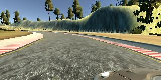  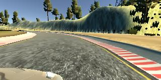

After the collection process, I had 35126 number of data points. I randomly shuffled the data set and put 20% of the data into a validation set and used this training data for training the model. The validation set helped determine if the model was over or under fitting. The ideal number of epochs was 4 as evidenced by saturated validation loss in 5 epochs training. 

## Training Performance

Here's the detailed mean square loss of each epoch for training and validation set :

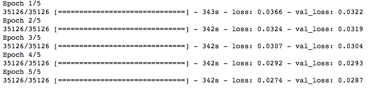
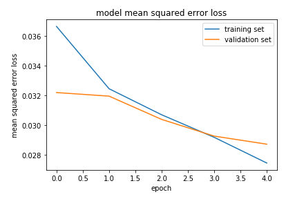

I used an adam optimizer so that manually training the learning rate wasn't necessary.
